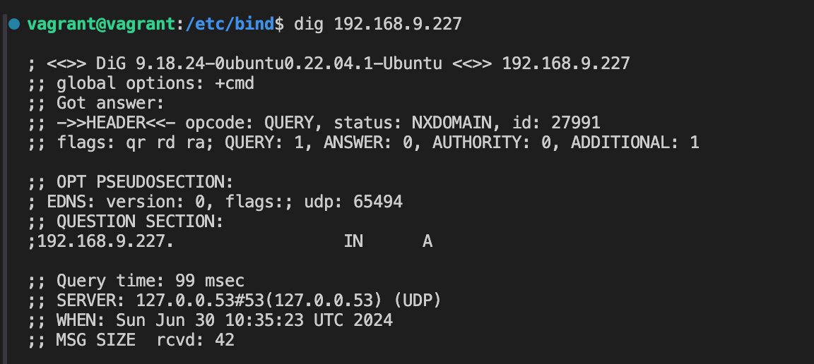

# Install and Configure a Private BIND DNS Server on Ubuntu

### 1.  _Install the latest updates_

```sh
sudo apt update -y && apt upgrade -y
```

### 2.  _Install BIND 9 on the DNS server_

```sh
sudo apt install bind9 bind9utils bind9-doc -y
```

 Check the status BIND 9 service

```sh
sudo systemctl status bind9
```

<p align="left">
 
</p>

### 3.  _Setting Up DNS Forwarding_

Edit `/etc/bind/named.conf.options`

```javascript
options {
        directory "/var/cache/bind";
        allow-query { any; };
        forwarders {
            192.168.9.254;
            8.8.8.8; 
        };
        recursion yes;
        dnssec-validation auto;
};
```
Restart the BIND 9 service
```sh
sudo systemctl restart bind9
```

### 4.  _Setting Up DNS Zones (Domain Names)_

Edit `/etc/bind/named.conf.local`

```javascript
zone "class.local"  {
    type master;
    file "/etc/bind/db.class.local";
};

zone "9.168.192.in-addr.arpa"  {
    type master;
    file "/etc/bind/db.9";
};
```
Create the `/etc/bind/zones/` directory.
```sh
sudo mkdir /etc/bind/zones
```

Create our new zone file by copying an existing template file
```sh
sudo cp db.local db.class.local
```
Edit `/etc/bind/db.class.local`
```javascript
;
; BIND data file for cless.local
;
$TTL    604800
@       IN      SOA     class.local. root.class.local. (
                              3         ; Serial
                         604800         ; Refresh
                          86400         ; Retry
                        2419200         ; Expire
                         604800 )       ; Negative Cache TTL
;
@       IN      NS      ad1.class.local.
@       IN      A       192.168.9.227
@       IN      AAAA    ::1
ad1     IN      A       192.168.9.227
```
- `ad1` - hostname our server;
- `192.168.9.227` - ip adress our server.

Restart the BIND 9 service
```sh
sudo systemctl restart bind9
```

Edit `/etc/resolv.conf`
```javascript
nameserver 192.168.9.227
options edns0 trust-ad
search class.local
```

### 5.  _Test DNS Server with dig & nslookup_
```sh
dig 192.168.9.227
```
<p align="left">
 
</p>


