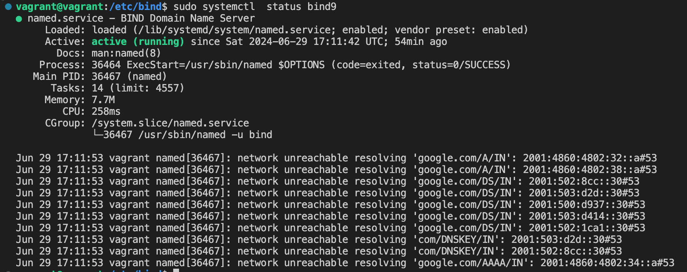
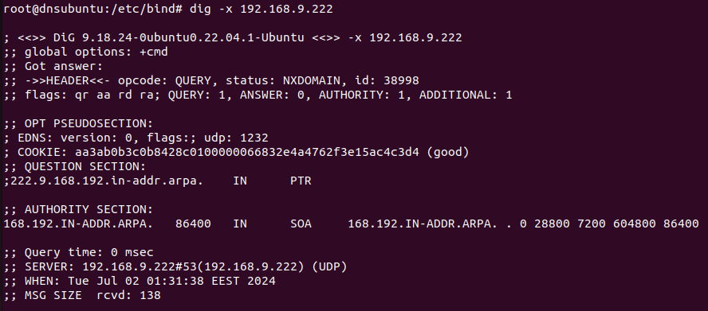
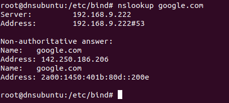
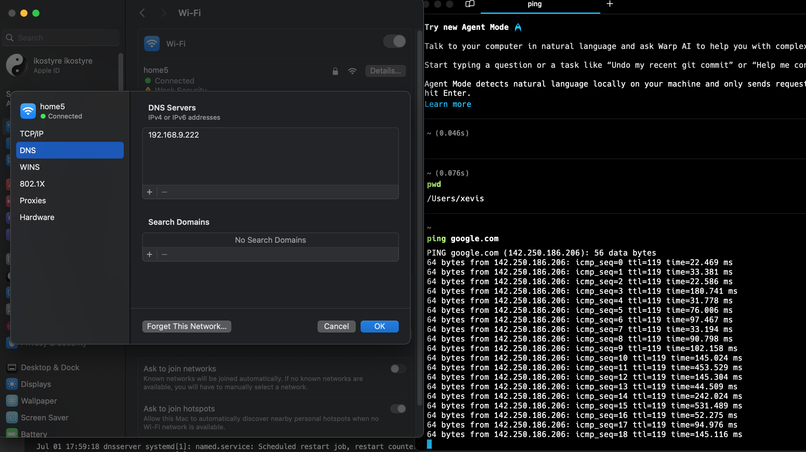

# Install and Configure a Private BIND DNS Server on Ubuntu

Lab Setup
* Bind Server IP (Ubuntu 22.04)  = 192.168.9.222
* Domain Name = test.local
* Private Network = 192.168.9.0/24
### 1.  _Install the latest updates_

```sh
sudo apt update -y && apt upgrade -y
```

### 2.  _Install BIND 9 on the DNS server_

```sh
sudo apt install bind9 bind9utils bind9-doc -y
```

 Check the status BIND 9 service

```sh
sudo systemctl status bind9
```

<p align="left">
 
</p>

### 3.  _Setting Up DNS Forwarding_

Edit `/etc/bind/named.conf.options`

```javascript
acl internal-network {
192.168.9.0/24;
};
options {
        directory "/var/cache/bind";
        allow-query { localhost; internal-network; };
        allow-transfer { localhost; };
        forwarders { 8.8.8.8; };
        recursion yes;
        dnssec-validation auto;
        listen-on-v6 { any; };
};
```
Restart the BIND 9 service
```sh
sudo systemctl restart bind9
```

### 4.  _Setting Up DNS Zones (Domain Names)_

Edit `/etc/bind/named.conf.local`

```javascript
zone "test.local" IN {
        type master;
        file "/etc/bind/forward.test.local";
        allow-update { none; };
};
zone "9.168.192.in-addr.arpa" IN {
        type master;
        file "/etc/bind/reverse.test.local";
        allow-update { none; };
};
```
Create the `/etc/bind/zones/` directory.
```sh
sudo mkdir /etc/bind/zones
```

Create our new zone file by copying an existing template file
```sh
sudo cp db.local forward.test.local
```
Edit `/etc/bind/forward.test.local`
```javascript
$TTL 604800
@ IN SOA primary.test.local. root.primary.test.local. (
                                   2022072651 ; Serial
                                   3600 ; Refresh
                                   1800 ; Retry
                                   604800 ; Expire
                                   604600 ) ; Negative Cache TTL
;Name Server Information
@       IN  NS    primary.test.local.

;IP address of Your Domain Name Server(DNS)
primary IN  A     192.168.9.222

;Mail Server MX (Mail exchanger) Record
linuxtechi.local. IN MX 10   mail.test.local.

;A Record for Host names
www     IN  A    192.168.9.223
mail    IN  A    192.168.9.224

;CNAME Record
ftp     IN CNAME www.test.local.
```
Create reverse lookup zone file at the same location
```sh
sudo cp db.127 reverse.test.local
```
Edit `/etc/bind/reversse.test.local`
```javascript
$TTL 86400
@ IN SOA test.local. root.test.local. (
                           2022072752 ;Serial
                           3600 ;Refresh
                           1800 ;Retry
                           604800 ;Expire
                           86400 ;Minimum TTL
)
;Your Name Server Info
@ IN NS primary.linuxtechi.local.
primary   IN  A    192.168.9.222
;Reverse Lookup for Your DNS Server
222        IN PTR   primary.linuxtechi.local.
;PTR Record IP address to HostName
223        IN PTR   www.linuxtechi.local.
224        IN PTR   mail.linuxtechi.local.
```
Edit `/etc/default/named`
```javascript
OPTIONS="-u bind -4"
```
Start and enable the BIND service
```sh
sudo systemctl start named
sudo systemctl enable named
```

Restart the BIND 9 service
```sh
sudo systemctl restart bind9
```

Edit `/etc/resolv.conf`
```javascript
nameserver 192.168.9.222
search test.local
```

### 5.  _Test DNS Server with dig & nslookup_
```sh
dig 192.168.9.222
```
<p align="left">
 
</p>

<p align="left">
 
</p>
Check DNS from host 
<p align="left">
 
</p>
