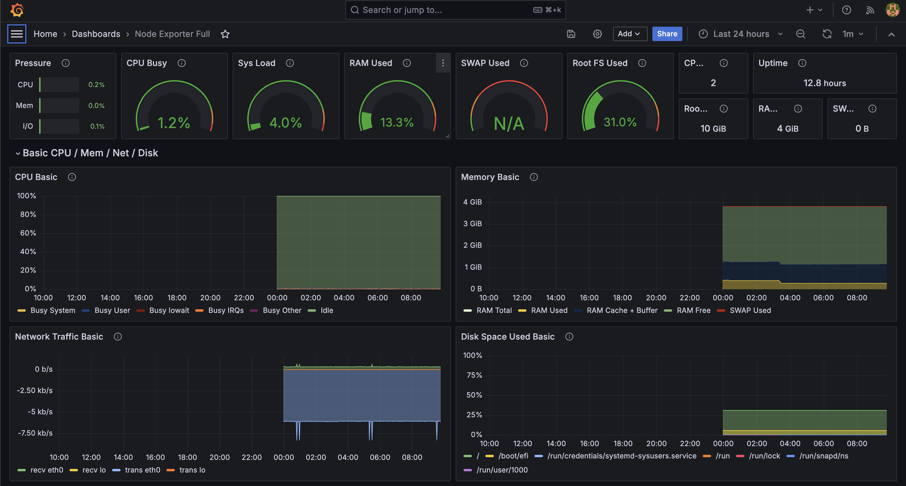
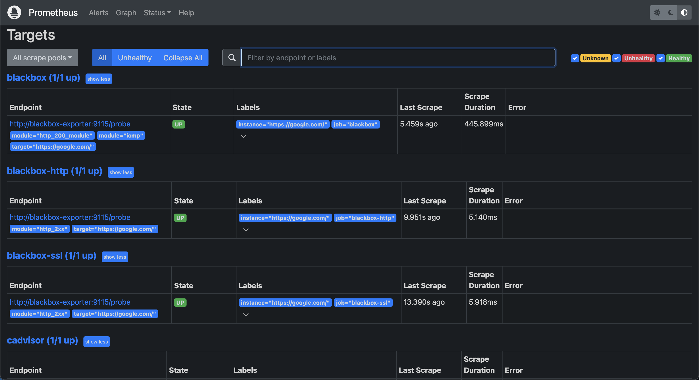

<p align="left">
 
</p>


This repository contains two Ansible playbooks designed for deploying monitoring tools in Docker containers on virtual machines in Google Cloud Platform (GCP) using `docker-compose`.

## Playbooks

### `vm1-playbook.yml`

This playbook deploys Prometheus exporters (cAdvisor and Node Exporter) in Docker containers on virtual machines in GCP using a `docker-compose.yml` file.

#### Roles and Tasks:

1. **Install Docker:**
    - Installs Docker on the virtual machine.
2. **Install Docker Compose:**
    - Installs Docker Compose on the virtual machine.
3. **Deploy cAdvisor and Node Exporter:**
    - Copies the `docker-compose.yml` file to the virtual machine.
    - Runs `docker-compose up` to start the services.

### `vm2-playbook.yml`

This playbook deploys Prometheus, Grafana, and Blackbox Exporter in Docker containers on another virtual machine in GCP using a `docker-compose.yml` file.

#### Roles and Tasks:

1. **Install Docker:**
    - Installs Docker on the virtual machine.
2. **Install Docker Compose:**
    - Installs Docker Compose on the virtual machine.
3. **Deploy Prometheus, Grafana, and Blackbox Exporter:**
    - Copies the `docker-compose.yml` file to the virtual machine.
    - Runs `docker-compose up` to start the services.

## Usage

To run these playbooks, ensure you have Ansible installed and properly configured to connect to your GCP instances.

1. **Clone the repository:**
    ```sh
    git clone <repository-url>
    cd <repository-directory>
    ```


2. **Run `vm1-playbook.yml`:**
    ```sh
    ansible-playbook -i host.ini vm1-playbook.yml
    ```

3. **Run `vm2-playbook.yml`:**
    ```sh
    ansible-playbook -i host.ini vm2-playbook.yml
    ```

### Inventory File

Make sure to have an `host.ini` file configured with your GCP instances. Example:

```ini
[vm1]
vm1.example.com ansible_user=your_user ansible_ssh_private_key_file=path_to_your_private_key

[vm2]
vm2.example.com ansible_user=your_user ansible_ssh_private_key_file=path_to_your_private_key
```

<p align="left">
 
</p>

<p align="left">
 
</p>
