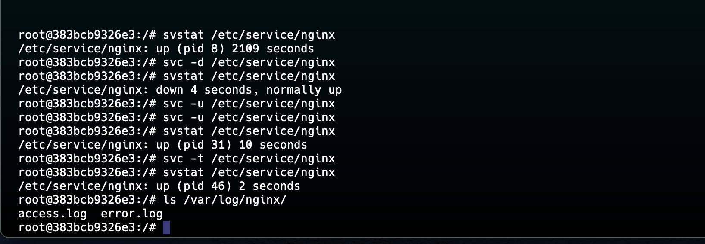

<p align="left">
 
</p>


### This [Dockerfile](./Dockerfile) will set up an nginx service managed by daemontools with logging handled by multilog, all within a Debian 11-based container.

```sh
    # Use Debian 11 as the base image
FROM debian:11

# Update the system and install required packages
RUN apt-get update && \
    apt-get install -y \
    daemontools \
    nginx && \
    apt-get clean && \
    rm -rf /var/lib/apt/lists/*

# Create directories for the nginx service and logs, managed by daemontools
RUN mkdir -p /etc/service/nginx /etc/service/nginx/log /var/log/nginx

# Create the run file for the nginx service
RUN echo '#!/bin/sh' > /etc/service/nginx/run && \
    echo 'exec nginx -g "daemon off;"' >> /etc/service/nginx/run && \
    chmod +x /etc/service/nginx/run

# Create the run file for multilog to manage nginx logs
RUN echo '#!/bin/sh' > /etc/service/nginx/log/run && \
    echo 'exec multilog t s100000 /var/log/nginx' >> /etc/service/nginx/log/run && \
    chmod +x /etc/service/nginx/log/run

# Use svscan to manage services under /etc/service
CMD ["svscan", "/etc/service"]
```

## [1.Starting Services with `svscan`]()
#### `svscan` is the command that monitors a directory of services and starts each service that it finds.
```sh
    sudo svscan /etc/service
```

## [2. Checking the Status of a Service with `svstat`]()
#### `svstat` provides the status of a service managed by supervise.
```sh
    sudo svstat /etc/service/nginx
```
#### - This command checks the status of the nginx service. It will display information such as whether the service is up or down, its process ID (PID), and how long it has been running.

## [3. Starting a Service with `svc`]()
#### `svc` is used to control services (start, stop, restart, etc.) that are managed by supervise.
```sh
    sudo svc -u /etc/service/nginx
```
#### - The -u option tells `svc` to bring the nginx service "up" (start it if it's not running).

## [4. Stopping a Service with `svc`]()

```sh
    sudo svc -d /etc/service/nginx
```
#### - The -d option tells `svc` to bring the nginx service "down" (stop it if it's running).

## [5. Restarting a Service with sv]()

```sh
    sudo svc -t /etc/service/nginx
```
#### - The -t option tells `svc` to send a "terminate" signal, effectively restarting the nginx service.

## [6. Managing Logs with `multilog`]()
#### `multilog` is used to manage and store logs for a service, often used in conjunction with daemontools.
##### The following command is an example of what multilog might be doing in the background, as defined in your run script for logs:

bash

```sh
    exec multilog t s100000 /var/log/nginx
```
- t: Adds a timestamp to each log entry.
- s100000: Limits the log file size to 100,000 bytes. When the limit is reached, a new log file is created.
- /var/log/nginx: The directory where logs are stored.

## [7. Viewing Logs Managed by `multilog`]()
#### You can view the logs that `multilog` has created by accessing the directory where they are stored:
```sh
    ls /var/log/nginx/
```
#### - This command lists the log files created by `multilog` for the nginx service. You can then use tools like cat, less, or tail to view the contents of these logs.

## [8. Automatically Restarting a Service on Failure]()
 - `supervise` will automatically restart the service if it fails. This behavior is inherent in how `daemontools` works, so you don't need to run additional commands for this functionality.
  - Simply ensure that your nginx service is being managed by `svscan` (as configured in your Dockerfile), and it will be restarted automatically if it stops unexpectedly.


## [Summary]()
#### **Using daemontools, you can effectively manage services like nginx by starting, stopping, restarting them, and checking their status. Additionally, multilog can be used to manage and rotate logs, ensuring that log files are properly handled without manual intervention. This suite of tools is powerful for maintaining reliable service operation, especially in environments where uptime and automated recovery are critical.**

<p align="left">
 
</p>