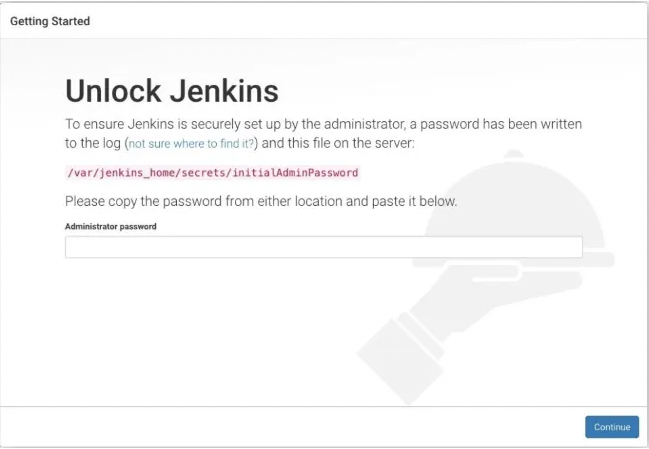
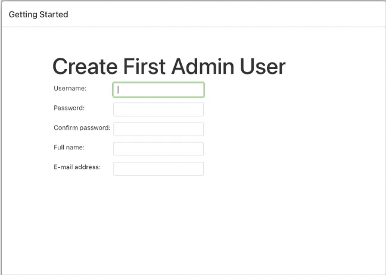
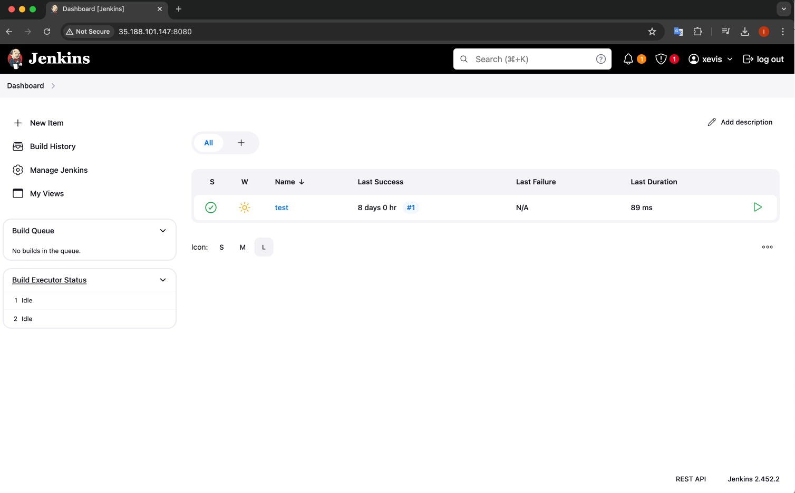

<p align="left">
 
</p>

# Install and Configure Jenkins

 #### Prerequisites
 1. Java Development Kit (JDK)
 2. Git

 ## Step 1: Install Jenkins For Linux Systems (Ubuntu/Debian)

```sh
    sudo wget -O /usr/share/keyrings/jenkins-keyring.asc \
     https://pkg.jenkins.io/debian-stable/jenkins.io-2023.key
    echo "deb [signed-by=/usr/share/keyrings/jenkins-keyring.asc]" \
     https://pkg.jenkins.io/debian-stable binary/ | sudo tee \
    /etc/apt/sources.list.d/jenkins.list > /dev/null
    sudo apt-get update
    sudo apt-get install jenkins
```
After Installation of Jenkins, You can start the Jenkins service
```sh
    sudo systemctl start jenkins
```
Also enable the Jenkins service to start at boot
```sh
    sudo systemctl enable jenkins
```
Check the status of the Jenkins service
```sh
    sudo systemctl status jenkins
```

## Step 2: Access Jenkins Dashboard

### Open Jenkins Dashboard: 
Open your web browser and enter `http://localhost:8080` in the address bar. If Jenkins is running on a remote server, replace `localhost` with the server's IP address or hostname.

### Unlock Jenkins
When you first access a new Jenkins instance, you are asked to unlock it using an automatically-generated password. You’ll need to retrieve this password from the Jenkins server.
<p align="left">
 
</p>

### Create Admin User
Create an admin user for accessing Jenkins and managing configurations.
<p align="left">
 
</p>

## Step 3: Basic Configuration

Install Additional Plugins (Optional): Go to Manage Jenkins > Manage Plugins and install additional plugins as needed (e.g., Git, Docker Pipeline).

<p align="left">
 
</p>