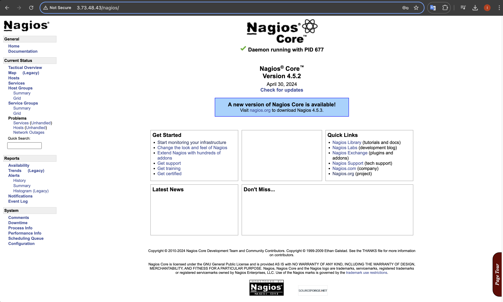
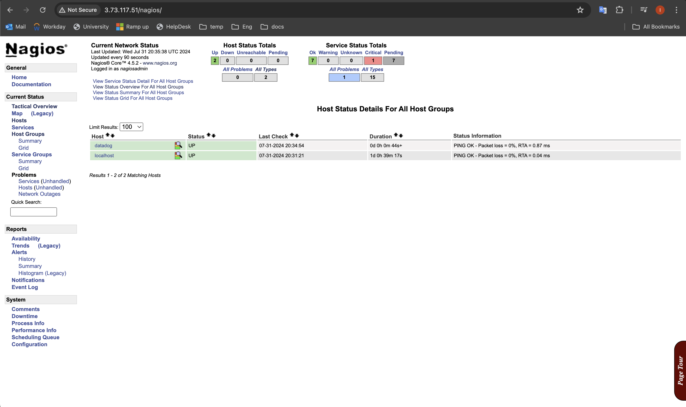
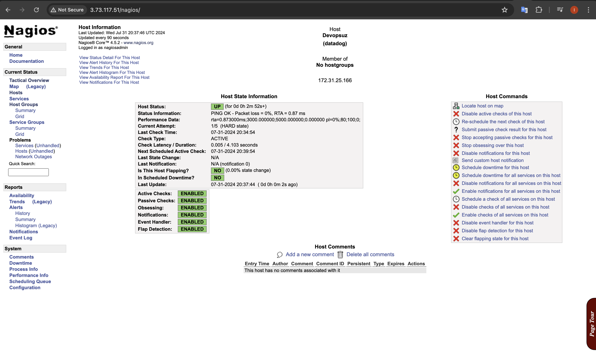
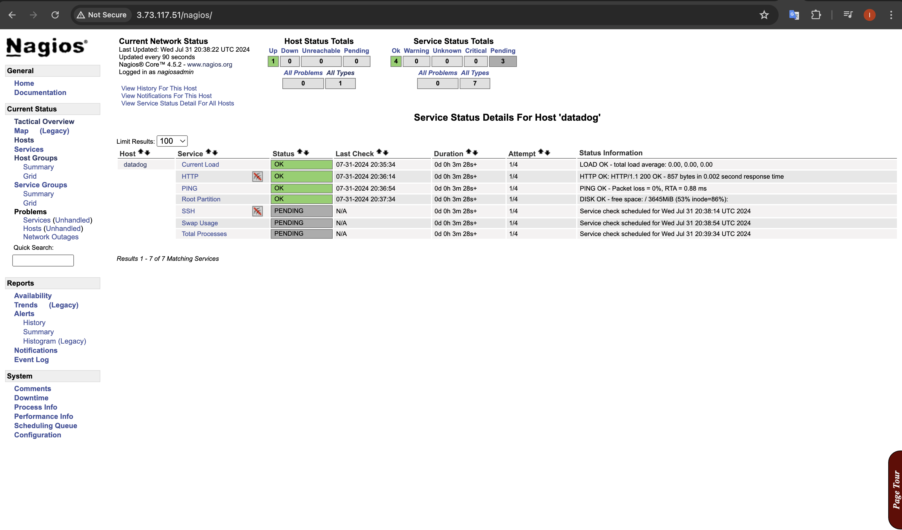

<p align="left">
 
</p>

- [Source tutorial](https://medium.com/@patilhimanshu139/monitoring-aws-ec2-instance-with-nagios-on-ubuntu-57c89b09016b "Medium")

## Steps:

## * Install nagios from [install script](nagiosinstall.sh)

### default page of nagios
<p align="left">
 
</p>


## * Install Nrpe server on client machine 

```sh
    apt install nagios-nrpe-server nagios-plugins 
```
## * Configure Nagios Client

` vi /etc/nagios/nrpe.cfg  `

##### On the “allowed_hosts” line, add theNagios Server IP addresses

```sh
  allowed_hosts=127.0.0.1, 3.73.117.51 
```
##### After that restart the nrpe client by following command
```sh
  systemctl restart nagios-nrpe-server
```
##### And restars nagios server
```sh
  systemctl restart nagios
```


### Go to the nagios console and check hosts

<p align="left">
 
</p>

### Informaion about EC2 instace

<p align="left">
 
</p>

### Services which running and up in the instance 

<p align="left">
 
</p>


