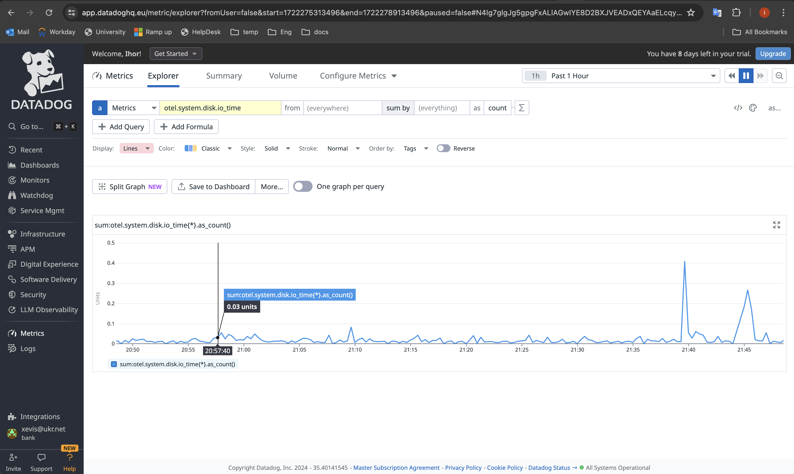
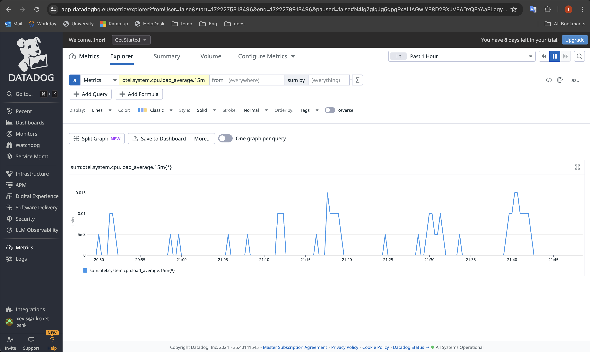
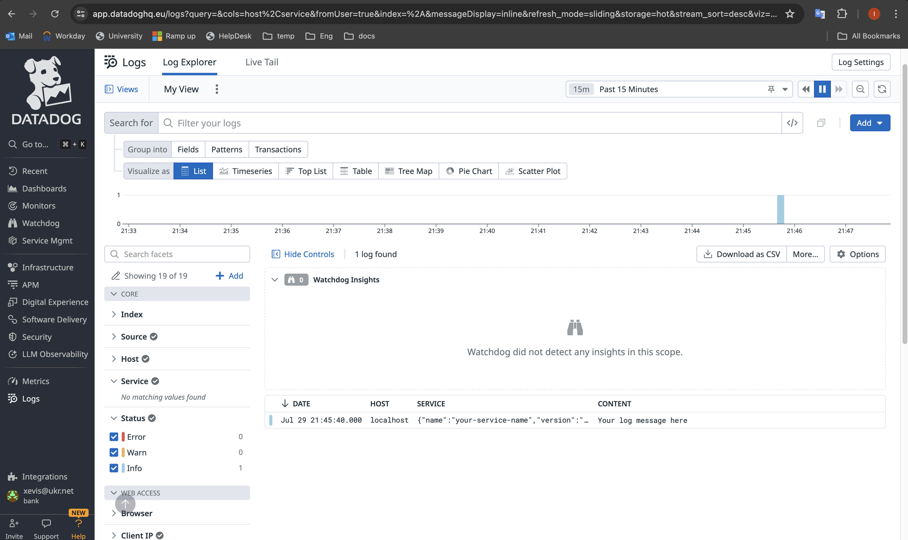

<p align="left">
 
</p>

- [Source tutorial](https://betterprogramming.pub/distributed-tracing-with-opentelemetry-and-datadog-712f8f4d520b "GitHub_Datadog")
- [Source tutorial](https://medium.com/@gerardyin/setting-up-an-opentelemetry-collector-that-exports-to-datadog-cb5d5dceadb7 "DevOpsScholl")

## Setup and Configuration
1. [Download an OpenTelemetry collector](https://betterprogramming.pub/distributed-tracing-with-opentelemetry-and-datadog-712f8f4d520b )

2. Configure the collector to export telemetry data to DataDog
   * [OpenTelemetry collector configuration file](config.yml)
   #### `configure your the DataDog site URL and API key`

3. Run the collector
```sh
    ./otelcol-contrib --config=config.yaml
```

4. Observe your infrastructure metrics in DataDog

<p align="left">
 
</p>

<p align="left">
 
</p>

5. Simulate an application sending logs to the collector, observe the result in DataDog
   * Create a Bash script [testCollectorLogs.sh](testCollectorLogs.sh) 
   * Execute script and  see a similar result:

```sh
    $ ./testCollectorLogs.sh
{"partialSuccess":{}}200
```
#### The HTTP response 200 indicates that the collector has successfully processed your input log

<p align="left">
 
</p>


